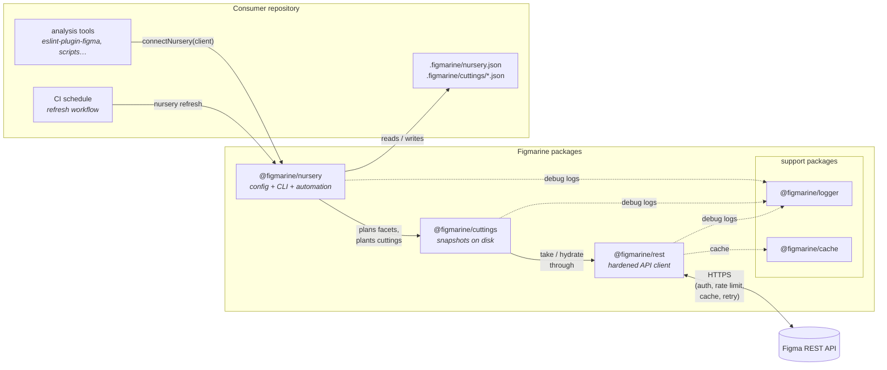
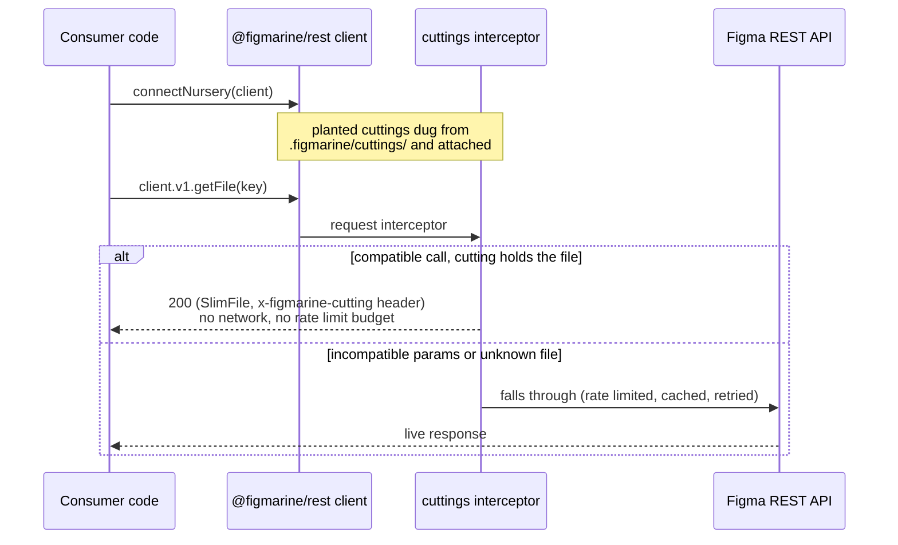
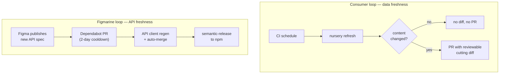

# Figmarine architecture

Figmarine is a pnpm + Turborepo monorepo of tools for frontend and DevOps
engineers who use Figma. Its core value proposition is **making Figma data
cheap to consume**: fetch it robustly, snapshot it into reviewable files,
keep those files fresh automatically, and serve them back to programs
transparently so that analysis tooling works offline, deterministically,
and without burning API rate limits.

## The big picture

Three publishable packages form a pipeline, each depending only on the
previous one:

The dependency direction is strict and acyclic — `rest` knows nothing about
cuttings, `cuttings` knows nothing about nursery configs — but data flows
both ways: cuttings are *taken* downwards through the client, and *served*
back upwards into it.

## The three pillars

### `@figmarine/rest` — talk to Figma safely

A REST client generated from Figma's official OpenAPI spec
(`@figma/rest-api-spec`, regenerated automatically when Figma releases —
see [RELEASE_AUTOMATION.md](./RELEASE_AUTOMATION.md)), wrapped in a
hardened axios instance:

- token auth from the environment (`FIGMA_PERSONAL_ACCESS_TOKEN` /
  `FIGMA_OAUTH_TOKEN`),
- reactive and proactive **rate limiting** with 429 retries,
- an optional **development-mode disk cache** (`@figmarine/cache`),
- typed namespaces (`client.v1`, `client.v2`) for every endpoint.

Everything downstream funnels its network traffic through this one client,
so safeguards apply monorepo-wide. The client exposes its axios `instance`,
which is the extension point the cuttings package plugs into.

### `@figmarine/cuttings` — snapshot Figma content

A *cutting* is a JSON snapshot of Figma content, fetched over the REST API
and planted on disk. Like the botanical kind, you take a cutting once and
re-hydrate it whenever you need fresh data:

- `take({ client, facets })` fetches the data described by *facets*
  (endpoint + id pairs, e.g. `GetFile:abc123`) and fills the cutting's
  `data` dictionaries.
- `plantCutting` / `digCutting` store and load cuttings, zod-validated,
  pretty-printed, and **diff-stable**: replanting unchanged content writes
  nothing, so scheduled refreshes only produce diffs when Figma content
  actually changed.
- File bodies are **slimmed** (`SlimFile`): volatile fields such as
  `thumbnailUrl` or `role` are dropped so diffs stay meaningful.
- `attachCuttings(client, cuttings)` closes the loop: it intercepts the
  client's compatible `GET` calls and serves them **from the cutting
  instead of the network** (see the sequence below).

### `@figmarine/nursery` — keep cuttings alive

The nursery turns cuttings into zero-thought infrastructure for a consumer
repository. It owns the committed `.figmarine/` state:

- `nursery init <figma url>` parses Figma URLs into `nursery.json` entries
  (JSON-schema validated).
- `nursery take` / `refresh` / `status` plan facets from the config, fetch
  through `@figmarine/rest`, and plant into `.figmarine/cuttings/` —
  re-taking automatically when the config changed, and reporting staleness
  (`status --max-age` is a CI gate). All commands are also exported as
  library functions.
- Scheduled refresh templates for **GitHub Actions** and **CircleCI** open
  a PR only when content changed, and a **Claude Code skill** drives the
  CLI conversationally.
- `connectNursery(client)` digs every planted cutting and attaches them to
  a REST client in one call.

## Transparent consumption, end to end

The integration contract: **connecting never touches the network, and
anything a cutting cannot answer falls through untouched.** Freshness is
managed separately (`status`/`refresh`), so reads are deterministic and
work offline.

A call is served when it targets a snapshotted endpoint (`GetFile`,
`GetFileComponents`, `GetFileComponentSets`, `GetFileStyles`) for a file
key an attached cutting holds, with query parameters the stored data can
honour (e.g. a `GetFile` with `depth` or `ids` always goes to the
network; a `version` must match the facet's pin or the stored version).

## Keeping data fresh without keeping humans busy

Two automation loops surround the pipeline:

- The **consumer loop** is powered by the nursery's workflow templates and
  cuttings' diff-stability: refreshes that find no content change are
  byte-identical no-ops.
- The **Figmarine loop** keeps the generated client in lockstep with
  Figma's published spec with no human in the loop for routine updates;
  it is documented in detail in
  [RELEASE_AUTOMATION.md](./RELEASE_AUTOMATION.md).

## Package inventory

| Package | Published | Role |
| --- | --- | --- |
| `@figmarine/rest` | ✅ | Generated, hardened Figma REST API client |
| `@figmarine/cuttings` | ✅ | Snapshot format, take/hydrate/plant/dig, transparent serving |
| `@figmarine/nursery` | ✅ | `.figmarine/` config, `nursery` CLI, refresh automation, `connectNursery` |
| `@figmarine/logger` | ✅ | Shared opt-in debug logging (`FIGMARINE_DEBUG`, stderr) |
| `@figmarine/cache` | ✅ | Disk-backed cache used by the client's development mode |
| `eslint-plugin-figma` | 🚧 | Lint Figma files offline from planted cuttings (future) |
| `@figmarine/config-*` | — | Internal ESLint / Prettier / tsup / TypeScript / Vitest presets |

Releases are fully automated with multi-semantic-release: conventional
commits on `main` version and publish each package independently, with
workspace ranges rewritten at publish time.
